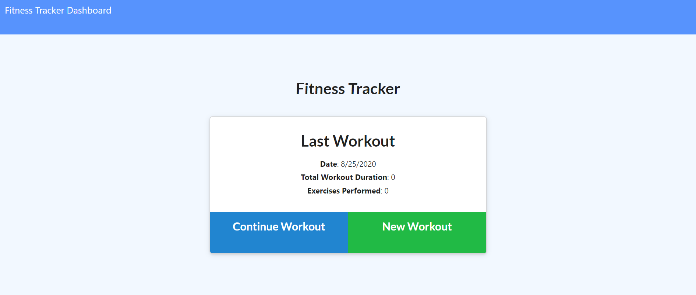

# NoSQL-Workout-Tracker

Workout Tracker
## Table of contents
* [General info](#general-info)  
* [User Story](#user-story)  
* [Business Context](#business-context)  
* [Instructions](#instructions)  
* [Link to Deployed App](#link-to-deployed-app)  
* [GitHub Repo](#github-repo)
* [Portfolio Page](#portfolio-page)
* [Screenshots](#screenshots) 

## General Info
Create a workout tracker. Create Mongo database with a Mongoose schema and handle routes with Express.

## User Story
As a user, I want to be able to view create and track daily workouts. I want to be able to log multiple exercises in a workout on a given day. I should also be able to track the name, type, weight, sets, reps, and duration of exercise. If the exercise is a cardio exercise, I should be able to track my distance traveled.

## Business Context
A consumer will reach their fitness goals quicker when they track their workout progress.

## Acceptance Criteria
When the user loads the page, they should be given the option to create a new workout, or continue with their last workout.
The user should be able to:

* Add exercises to a previous workout plan.

* Add new exercises to a new workout plan.

* View multiple the combined weight of multiple exercises on the stats page.

## Link to Deployed App
[Link to deployed app](https://quiet-oasis-96954.herokuapp.com//) 
(https://quiet-oasis-96954.herokuapp.com/)

## GitHub Repo:
https://github.com/helmsjames/Workout-Tracker   

## Portfolio Page
https://github.com/helmsjames

## Screenshots

